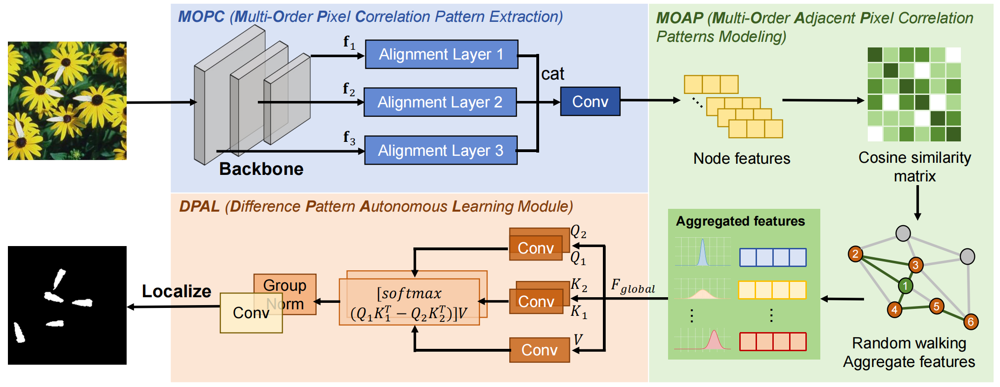
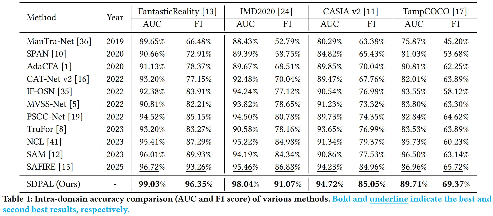
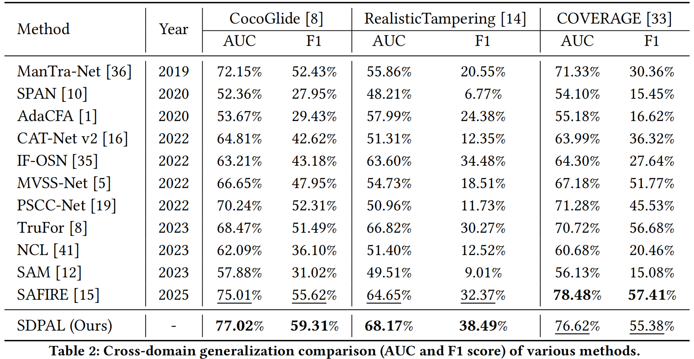

# Spatial Difference Patterns Adaptive Learning For Image Forgery Localization

Existing works focus on extracting forgery features using label information, and the models are limited by the type and quantity of training forged samples, resulting in insufficient generalization capability. Experiments reveal that different forged images exhibit significant differences in pixel correlation patterns. Therefore, starting from the original pixel space of images, this paper proposes a high-precision, strong-generalization, and localizable image forgery recognition method by extracting differences in interpixel correlation patterns: Spatial Difference Patterns Adaptive Learning For Image Forgery Localization (SDPAL). 

- The correlation patterns of image pixels include long- and short-distance correlation patterns based on differences in pixel positions. To extract pixel correlation patterns at different distances, we adopt a multiorder pixel correlation pattern extraction approach to obtain pixel correlation patterns of different ranges. 
- To address the problem of numerous hierarchical correlation trajectories in the pixel space and high computational complexity, we use random walks for sampling and learning, which reduces computational complexity while obtaining different-range correlation patterns trongly related to forgery. 
- Furthermore, we construct an difference pattern adaptive learning mechanism, which improves the sensitivity and accuracy of forgery localization by dynamically mining abnormal correlation patterns. 

Experimental results show that the proposed method significantly improves localization accuracy and generalization capability in challenging forgery scenarios, achieving an F1-score improvement of nearly 5% compared with state-of-the-art methods across multiple benchmark datasets.



## Get Started

1. Install Python 3.10, PyTorch >= 2.8.
2. Train and evaluate. You can reproduce the experiment results on CASIA v2 dataset as follows:

```python
python main.py
```

## Main Result

**Intra-domain Accuracy Comparison.** Table 1 reports each method's localization performance in terms of F1 score and AUC. We observe that SDPAL achieves the highest performance on FantasticReality, IMD2020, and TampCOCO datasets.



**Cross-domain Generalization Comparison.** As shown in Table 2, on the COVERAGE test set, SDPAL achieved F1 and AUC scores second only to SAFIRE, a method proposed in 2025. This indicates that SDPAL demonstrates superior anti-interference capability and robustness compared to other methods when handling high-fidelity tampering scenarios.

